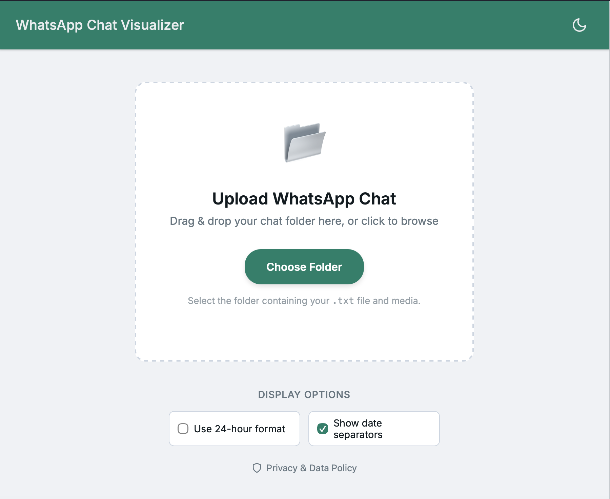
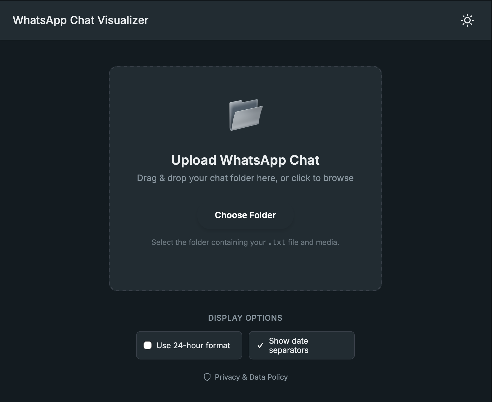

# WhatsApp Chat Visualizer

  
  &nbsp;
  

A simple, secure, and beautiful tool to visualize exported WhatsApp chats.

## Purpose

WhatsApp currently does not allow new group participants to view messages sent before they joined. This tool solves that problem. You can ask an existing group member or the creator to export the chat history and send it to you. Then, use this tool to visualize and read the entire conversation history comfortably.

## Features

- **Privacy-First**: All processing happens 100% on your device. No data is ever uploaded to any server.
- **Drag & Drop**: Simply drag the exported folder to start visualizing.
- **Rich Media**: Supports viewing images and system messages within the chat flow.
- **Responsive**: Works seamlessly on desktop and mobile devices.

## How to Export Chat (WhatsApp)

To use this tool, you need an exported chat file from WhatsApp. Watch this short tutorial to learn how to export your chat:

## How to Use

1. Open the tool in your browser.
2. Drag and drop the folder containing your exported chat (ensure it contains the `.txt` file) into the upload area.
3. Alternatively, click "Choose Folder" to select the folder manually.
4. The chat will load instantly, allowing you to scroll through history.

## Credits

  

Open Source. Built with modern web technologies.
